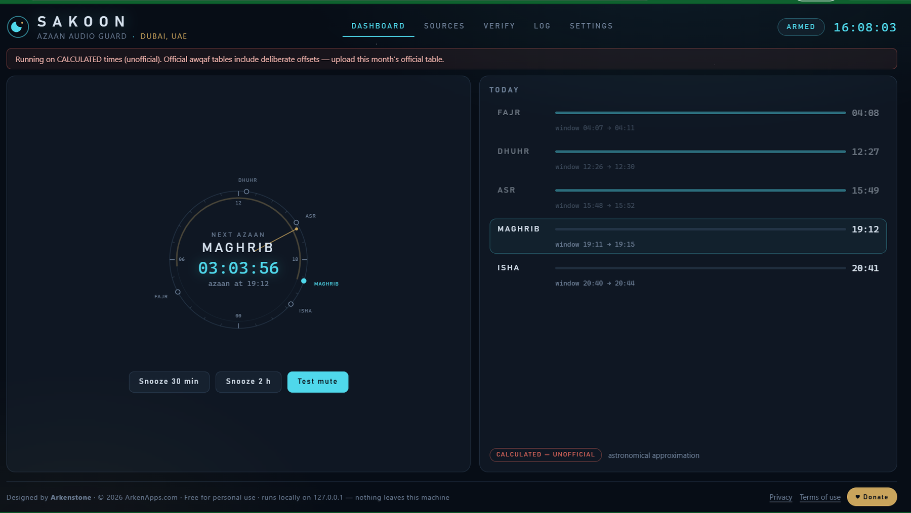
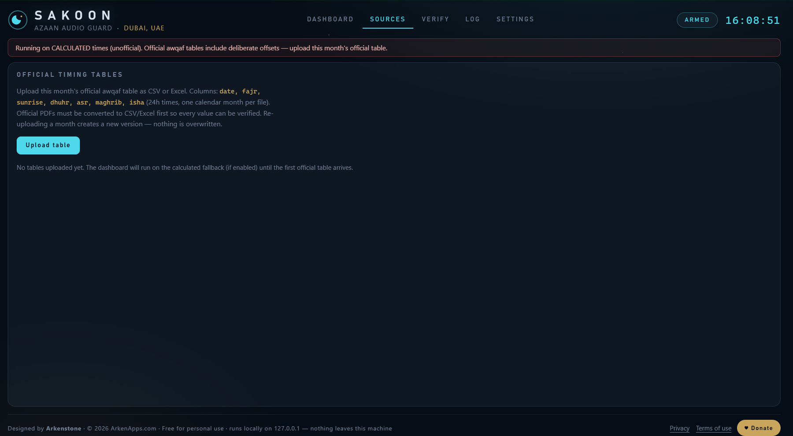
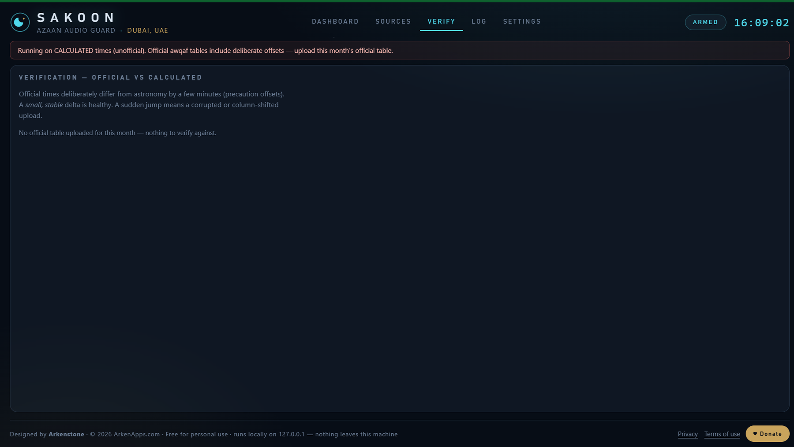
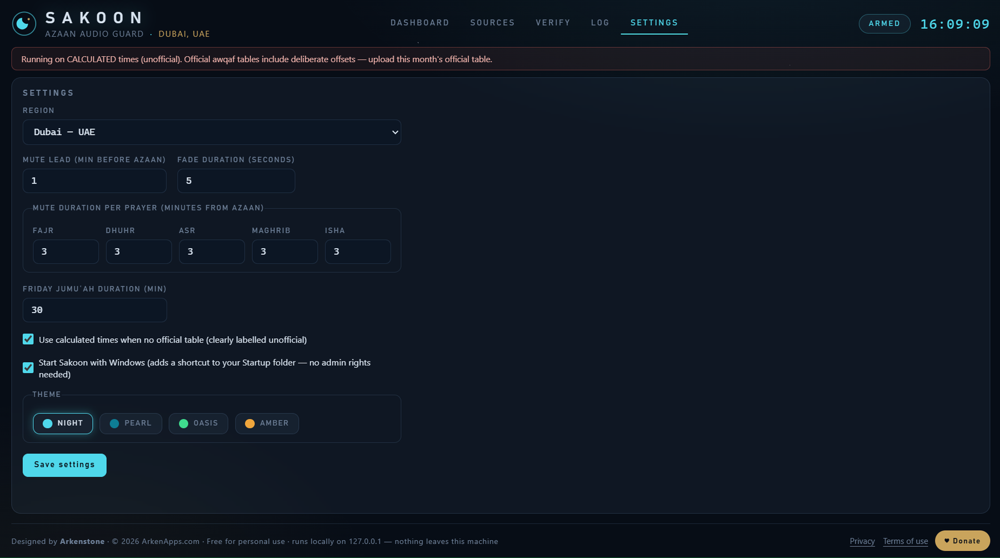
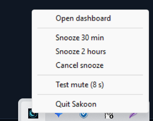

# Sakoon · سكون

### Your PC can observe the azaan too.

A private, local-first Windows desktop app that mutes system audio before
each azaan, keeps the computer quiet through the configured window, and restores
the previous audio state afterwards.

[Download Sakoon](https://github.com/arkenapps/Sakoon/releases/latest/download/Sakoon.exe)
·
[Product website](https://arkenapps.com/azaan-audio-guard.html)
·
[Read how it works](docs/about.md)
·
[Timing-table guide](docs/table-format-guide.md)
·
[Report a problem](https://github.com/arkenapps/Sakoon/issues/new/choose)

---

## What Sakoon does

Walk through a mall in Dubai, Riyadh, or Doha when the azaan begins and the
music quietly stops. A few minutes later, normal activity resumes.

Sakoon brings that same small courtesy to a Windows PC:

1. It reads the prayer times for the selected region.
2. One minute before the configured azaan window, it mutes system audio.
3. It preserves the current mute state and volume before touching audio.
4. It stays silent through the configured window.
5. It restores the previous state afterwards—unless the user has manually
   taken control.

The name **Sakoon** means *stillness*.

> **Important:** Sakoon is a convenience tool, not a religious authority.
> Official awqaf publications and your local mosque always take precedence.
> Never depend on Sakoon as your only prayer reminder.

## Why it is different

### Official tables come first

Prayer times differ by authority, country, city, and sometimes by emirate.
Sakoon therefore treats an uploaded official monthly CSV or Excel table as the
source of truth.

The built-in astronomical calculation is a fallback and verification aid. When
calculated times are being used, Sakoon labels them clearly as:

**CALCULATED — UNOFFICIAL**

The calculation does not replace an authority. It acts as a watchdog by showing
the difference between uploaded and calculated times so that shifted columns,
wrong dates, or damaged imports are easier to catch.

### Audio restoration is treated as a safety problem

Sakoon is designed around five practical rules:

- **Mute the endpoint; never touch the user's volume level.**
- **Capture and restore; never blindly toggle.**
- **Write recovery state before changing audio.**
- **Do not replay a missed azaan after sleep or wake.**
- **Respect manual user action immediately.**

This protects against the failure that matters most for an audio utility:
leaving the computer unexpectedly silent.

## Main features

| Area | Capability |
|---|---|
| Timing source | Official user-uploaded CSV/XLSX tables take priority |
| Fallback | Local solar calculation, always identified as unofficial |
| Verification | Official-versus-calculated daily delta view |
| Audio | Configurable lead-in before azaan, silent window, and automatic unmute |
| Recovery | Stored restore state for crash recovery |
| Sleep/wake | Wall-clock scheduling without replaying stale events |
| Friday | Configurable Jumu'ah window |
| Meetings | Tray snooze for 30 minutes or 2 hours |
| Devices | Follows supported Windows audio endpoint changes |
| Privacy | Fully local single-exe app; no open network ports, no account, no telemetry |
| Interface | Native desktop window (Wails); close hides to tray, guard keeps running |
| Startup | Visible Windows startup shortcut; no administrator rights required |
| Themes | Night, Pearl, Oasis, and Amber |

## Region presets

The first public release is designed around presets for:

`Dubai` · `Abu Dhabi` · `Sharjah` · `Riyadh` · `Jeddah` · `Doha` ·
`Kuwait` · `Manama` · `Muscat` · `Cairo` · `Amman` · `Beirut`

A preset does not make calculated times official. Upload the table published by
the relevant authority whenever it is available.

## Screenshots

### Dashboard and astrolabe dial

| Official timing sources | Official-versus-calculated verification |
|---|---|
|  |  |

| Settings | System tray controls |
|---|---|
|  |  |

[Open the Sakoon product website](https://arkenapps.com/azaan-audio-guard.html)
·
[Open the GitHub Pages edition](https://arkenapps.github.io/Sakoon/)

## Install

1. Open the [latest release](https://github.com/arkenapps/Sakoon/releases/latest).
2. Download `Sakoon.exe`.
3. Compare its SHA-256 hash with `SHA256SUMS.txt` from the same release.
4. Run Sakoon. Administrator access is not required. The native Sakoon
   window opens and a tray icon appears; on first run, a visible
   start-with-Windows shortcut is created automatically in your per-user
   Startup folder (removable any time from Settings).
5. Choose the correct region and review the timing source shown in the app.
   Closing the window hides Sakoon to the tray — the audio guard keeps
   running. Quit from the tray menu when needed.
6. Upload the current official timing table when one is available.
7. Confirm the imported dates and times in the preview before activating it.

Windows may show a reputation warning for a new unsigned application. Download
only from the official `arkenapps/Sakoon` release page and verify the published
hash.

**Requirements:** Windows 10 or 11. The app window uses Microsoft Edge
WebView2, which ships with Windows 11 and current Windows 10; on the rare
machine without it, Windows offers a one-time free install on first launch.

## Official table format

Sakoon supports monthly timing tables in CSV and Excel formats. The safest
portable structure is one row per local calendar date:

| Date | Fajr | Sunrise | Dhuhr | Asr | Maghrib | Isha |
|---|---|---|---|---|---|---|
| `YYYY-MM-DD` | `HH:MM` | `HH:MM` | `HH:MM` | `HH:MM` | `HH:MM` | `HH:MM` |

Recommended rules:

- Use local civil time exactly as published.
- Use 24-hour `HH:MM` values.
- Do not convert to UTC.
- Do not remove official precaution offsets.
- Avoid merged cells, formulas, decorative title rows, and multiple tables on
  one worksheet.
- Check every mapped column in Sakoon's import preview.
- Use the Verify view to inspect unexpected timing jumps.

Arabic headers are supported where they map unambiguously to the same fields.
See the complete [timing-table guide](docs/table-format-guide.md) before
preparing or contributing a table.

## Privacy

Sakoon is designed to remain on the user's computer:

- no account,
- no advertising,
- no telemetry,
- no cloud prayer-time request,
- no background data sale,
- no upload of user timing files.

Application data remains locally readable and removable by the user. See
[Privacy and local data](docs/privacy.md).

## Honest limitations

- Sakoon is currently a Windows application.
- It cannot guarantee that every authority's spreadsheet layout will import
  without cleanup.
- Calculated times are estimates and are never represented as official.
- Windows audio drivers, Bluetooth endpoints, docking stations, and vendor
  utilities can behave differently.
- Sleep, hibernation, abrupt shutdown, and device replacement are hardware-
  dependent conditions; report reproducible failures with diagnostics.
- Software can fail. Sakoon must not be the sole reminder for prayer.
- This public repository distributes documentation and release binaries. The
  Go source code is not published here.

## Contributing

Useful public contributions include:

- verified authority table formats,
- translations,
- documentation corrections,
- reproducible bug reports,
- accessibility feedback,
- requests for new region presets.

Read [CONTRIBUTING.md](CONTRIBUTING.md) before opening an issue or pull request.

## Security

Do not publish security vulnerabilities, private timing documents, personal
information, or diagnostic logs containing sensitive data in a public issue.
Follow [SECURITY.md](SECURITY.md) for private reporting.

## Licence

Sakoon is free for personal, non-commercial use under the
[ArkenApps Personal Use Licence](LICENSE.txt). Commercial use, paid bundling,
resale, and commercial redistribution require prior written permission.

This repository is public for transparency, documentation, issue tracking, and
official binary distribution. Public does not mean open source.

---

Built by **[ArkenApps](https://arkenapps.com/)**  
Designed by Arkenstone · Local-first · No tracking

*If Sakoon brings a little stillness to your day, a du'a for those who built it
is more than enough.*

